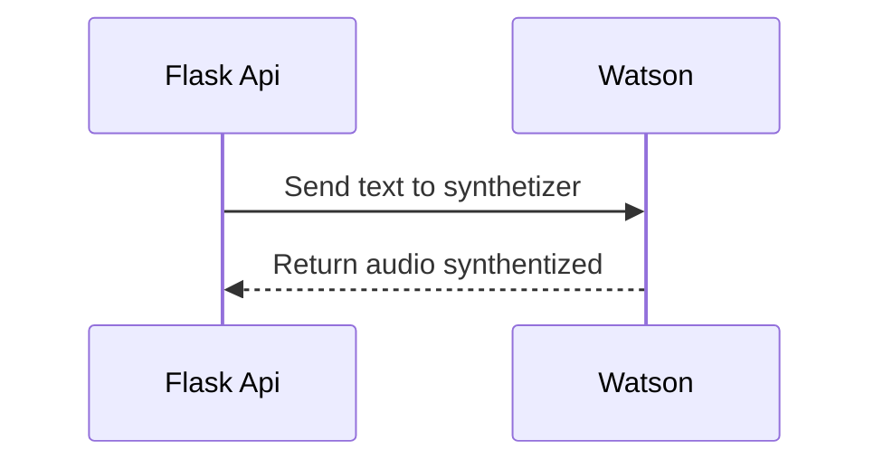

# Watson Parrot

Este projeto é um sintetizador de voz utilizando a API do IBM Watson

### Requisitos

 - Python 3.x
 - Credencial do IBM Watson
 
 ### Executar
Instale as dependencias
> $ (env) pip install -r requirements.txt

Execute o código
> $ (env) python robots/request_audio.py

Aidéia do projeto é fazer um serviço web utilizando *Flask*

