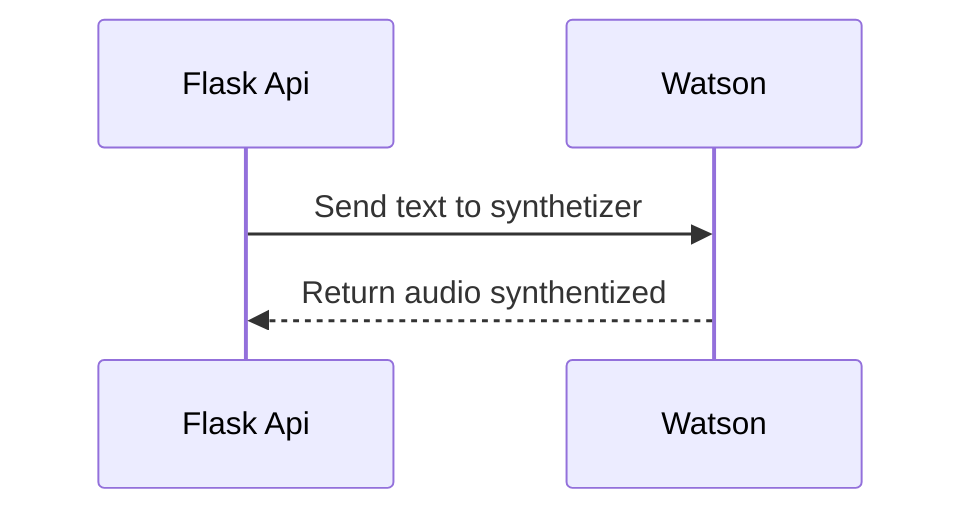

# Watson Parrot

Este projeto é um sintetizador de voz que utiliza a API do IBM Watson para interpretar arquivos de audio e gerar um texto correspondente.

### Requisitos

 - Python 3.x
 - Credencial do IBM Watson
 
 ### Rodando o projeto

Instalando as dependencias
> $ (env) pip install -r requirements.txt

Executando o código
> $ (env) python robots/request_audio.py

A idéia do projeto é desenvolver um serviço web utilizando *Flask*

